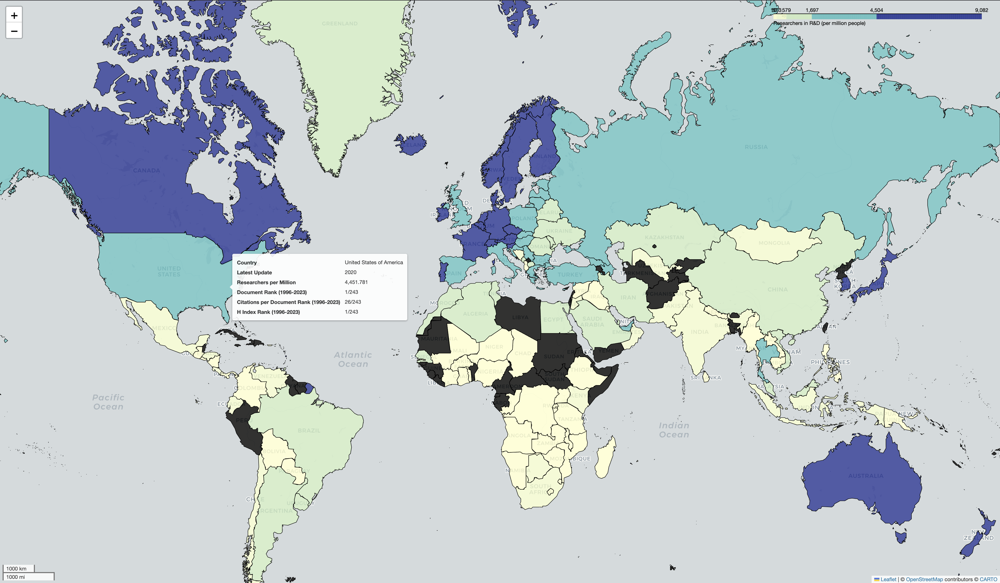

# World-Research-Map

### Overview
This project visualizes global research density data and Scimago indicators (H-index, Document publications, Citations per document) using **GeoPandas**, **Folium**, and **Pandas**.

The map highlights:
- Researchers in R&D (per million people)
- Scimago country ranks based on H-index, Document count, and Citation rate

### Features
- Interactive choropleth map with **Folium**.
- Tooltips with country-specific ranks and latest updates.
- Data integration from multiple sources:
  - Scimago Journal Rank (1996-2023)
  - Researchers per million people dataset
  - High-resolution shapefiles (Natural Earth)

---

### Dependencies
To run this project, install the required libraries:

```bash
pip install -r requirements.txt
```

---

### Usage
1. Clone the repository:
```bash
git clone https://github.com/akhyarthoriq/World-Research-Map.git
cd World-Research-Map
```
2. Ensure all required data files are in the `data/` folder.
3. Run the script:
```bash
python scripts/main.py
```
4. Outputs:
   - **Interactive Folium Map**: Generated in `results/research_density_map.html`.
   - **GeoJSON Map**: Exported to `results/research_density_map.geojson`.

---

## Viewing the Map

### 1. GitHub GeoJSON Visualization:
View the map directly on GitHub by opening the **GeoJSON file**:
- [View the GeoJSON Map](results/research_density_map.geojson)

### 2. Folium Interactive Map:
For full interactivity, download and open the HTML file locally:
- [Download Interactive Map](results/research_density_map.html)

---

## Dependencies
The required libraries are listed in `requirements.txt`. Install them using:

```bash
pip install -r requirements.txt
```

---

## Data Sources
- **Scimago Journal Rank**: [ScimagoJR](https://www.scimagojr.com/)
- **Researchers Density Data**: [Our World in Data](https://ourworldindata.org/grapher/researchers-in-rd-per-million-people?time=latest#all-charts)
- **Shapefile**: [Natural Earth Data](https://www.naturalearthdata.com/).

---

## Sample Output
Below is a preview of the final interactive map (HTML version):



---

## Author
- **Akhyar Thoriq**  
- GitHub: [akhyarthoriq](https://github.com/akhyarthoriq)

---

## Contributions
Feel free to fork, submit issues, or contribute to this project. Pull requests are welcome!

---

### Notes:
- Replace `your-username` and `your-repo-name` with your actual GitHub username and repository name.
- Include the `sample_map_screenshot.png` to showcase the output map visually.